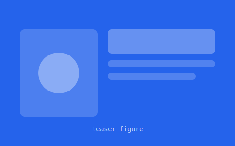

# Research dossier — an academic portfolio template

A fast, single-page academic / researcher portfolio with an editorial "research
dossier" feel. **No build step, no framework, no dependencies** — just open
`index.html`. Everything is driven by one data file (`content.js`), so you add a
paper or a news item by editing one object.



## Highlights

- **Publications, three ways** — switch between a **List**, a **Shelf** (book
  spines), and a **Graph**. The Graph itself has two views: papers linked by
  **Topic**, or by **Collaborator** — an ego-network of everyone you've
  co-authored with, sized by how many papers you share. Built automatically
  from your `authors` data, no extra config needed.
- **Light + dark** — warm-paper light theme and a deep dark theme; the toggle is
  remembered. Default is light.
- **Data-driven & data-gated** — sections appear only when their array in
  `content.js` has entries. Fill in `talks` and the Talks section + its nav link
  appear automatically.
- **Crimson + paper** palette, **Libre Baskerville** display serif over a system
  sans, subtle paper-grain texture.
- **Thoughtful interactions** — hover/click a paper for a lightbox (abstract,
  teaser GIF/video, links, one-click BibTeX), clickable research pills that jump
  to a topic, scroll reveal, "New" badges on recent news, back-to-top.
- **Responsive** from phone to desktop, and **accessible** (keyboard support,
  focus rings, reduced-motion aware).
- **Lightweight** — icons are inlined SVG (no icon webfont); only one web font is
  fetched. Works offline by double-clicking `index.html`.

## Files

| File | What it is |
|------|------------|
| `content.js` | **The only file you normally edit.** All your content. |
| `index.html` | Page shell (empty section containers). |
| `styles.css` | Design tokens (`:root`) + all component styles. |
| `script.js` | Renders the page from `content.js` and adds interactions. |
| `assets/` | Your portrait, paper teaser GIFs/images, and `cv.pdf`. |

> **Why `content.js` and not `content.json`?** Browsers block `fetch()` of local
> `.json` over `file://`, which would force you to run a web server. `content.js`
> is the *same data*, written as a JSON-style object (comments and trailing
> commas allowed), so the site works by simply double-clicking `index.html`.

## Quick start

1. Open `content.js` and replace the placeholder data with your own.
2. Drop your files in `assets/` — `portrait.*`, paper teasers (GIF/PNG), `cv.pdf`.
3. Open `index.html` (double-click) — or serve the folder and visit it.
4. Deploy the folder to GitHub Pages, Netlify, Vercel, or any static host.

## Editing content (`content.js`)

### A publication

```js
{
  title: "Improving diversity in text-to-image flow models",
  authors: [
    { name: "Your Name", url: "https://scholar.google.com/" }, // url optional → becomes a link
    { name: "Coauthor One" }
  ],
  me: "Your Name",          // your name is bold and never a link
  venue: "CVPR", year: 2026,
  topic: "Diversity",       // groups the paper in the graph + filters; match a research[].topic
  highlight: "Spotlight",   // "Oral" / "Best Paper" / null  → ring + badge
  teaser: "assets/teaser-1.svg",  // a GIF works great here
  abstract: "…",
  links: { pdf: "...", arxiv: "...", code: "...", project: "...", video: "..." },
  bibtex: "@inproceedings{...}"
}
```

- Only the `links` you fill in render as buttons.
- `video` accepts a YouTube/Vimeo embed URL or a direct `.mp4`; if there's no
  video the lightbox shows the `teaser` instead.
- `highlight` drives the badge, the card glow, the book-spine ring, and the graph
  node ring.

### Research interests (the pills under the bio)

```js
research: [
  { icon: "ti-sparkles", title: "Diverse generation", topic: "Diversity",
    blurb: "Shown as a tooltip." }
]
```

If a research item has a `topic` that matches a publication `topic`, its pill
becomes **clickable** and jumps to that topic in Publications. Icons are Tabler
names (`ti-...`); see "Add an icon" below.

### Optional sections

`news`, `talks`, `awards`, `teaching` are hidden (with their nav links) until you
add entries. News items dated within the last 30 days get a **"New"** badge
automatically (add `new: true` to an item to force the badge regardless of
date — handy for testing, or if you'd rather not rely on date parsing at all).

```js
news:  [{ date: "Jun 2026", text: "…", link: "#" }],
talks: [{ date: "Apr 2026", title: "…", venue: "…", links: { slides: "#" } }],
awards:[{ year: 2026, title: "…", detail: "…" }],
teaching:[{ term: "Spring 2026", role: "TA", course: "…" }]
```

## Customizing the look

Edit the variables at the top of `styles.css`:

- **Accent / palette** — `--accent` (+ `--accent-2`, `--accent-soft`) and the
  `--paper`/`--surface`/`--ink` tokens, under both `:root` (light) and
  `[data-theme="dark"]`.
- **Highlight colors** — `--hl-gold` (Spotlight) and `--hl-violet` (Oral).
- **Fonts** — `--font-display` (headings) and `--font-sans` (body). If you swap
  the display font, update the Google Fonts `<link>` in `index.html`.
- **Background grain** — the `body::after` rule; lower its `opacity` for a flatter
  look, or delete the rule entirely.

## Extending (in `script.js`)

The file has a header comment documenting its structure. The common moves:

- **Add a section** — write a `renderX()`, register it in the `SECTIONS` array,
  and add `<section id="x" class="section"></section>` to `index.html`.
- **Add an icon** — add its Tabler outline path data to the `ICONS` map and use
  `ic("name")`.
- **Tune behavior** — `HOVER_DELAY` (how long you hover a paper before the
  lightbox opens), the `isRecent(date, 30)` window for "New" badges, etc.

## Accessibility & performance notes

- Keyboard: nav, cards, spines, and graph nodes are focusable and operable with
  Enter/Space; Esc closes the lightbox.
- Respects `prefers-reduced-motion`.
- System fonts render instantly while the serif loads; teaser images are
  lazy-loaded; animations use only `transform`/`opacity`.

## To-do after cloning

- [ ] Fill in `content.js` (profile, research, publications, news, …)
- [ ] Add `assets/portrait.*`, teaser GIFs, and a real `assets/cv.pdf`
- [ ] Set your accent color in `styles.css` if desired
- [ ] (Optional) add a `favicon` — the template ships an inline SVG one
- [ ] Deploy to a static host

## License

MIT — use it freely. Attribution appreciated but not required.
